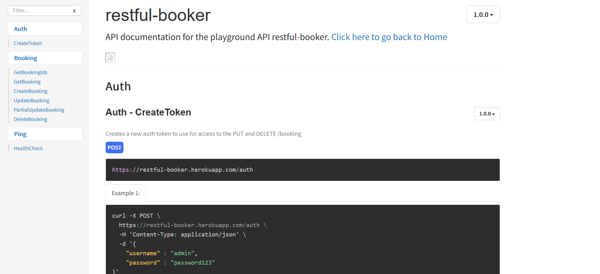
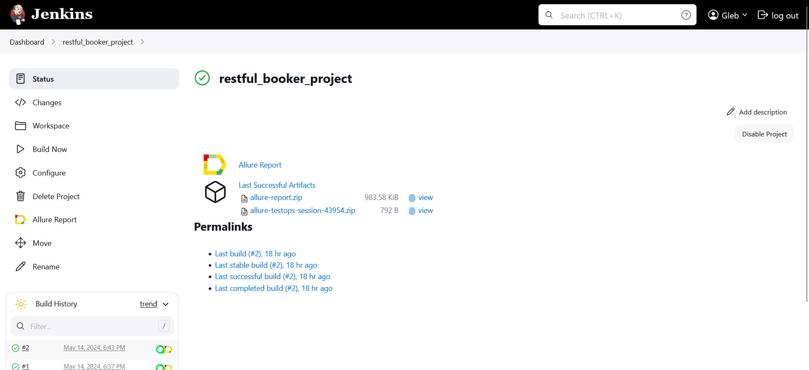
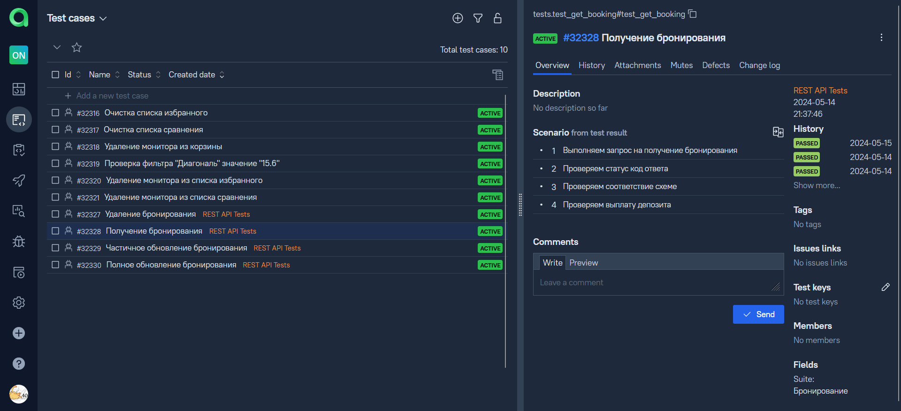
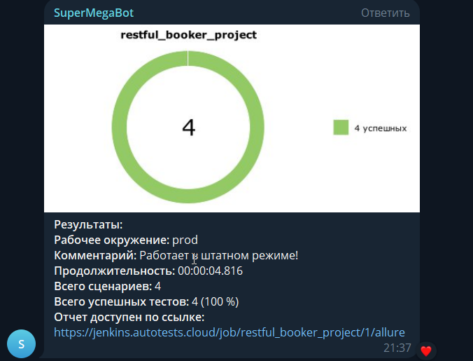

# Проект по тестированию Restful-booker API

><a target="_blank" href="https://restful-booker.herokuapp.com/apidoc/index.html">Restful-booker</a>
> 

---
### Список проверок, реализованных в автотестах
1. Создание бронирования.
2. Получение бронирования по ID.
3. Полное обновление бронирования.
4. Частичное обновление бронирования.
5. Удаление бронирования.

---

### Используемые инструменты
        

---

### Запуск автотестов осуществляется с использованием Jenkins
> [Ссылка на сборку в Jenkins](https://jenkins.autotests.cloud/job/restful_booker_project/)

#### Для запуска автотестов в Jenkins
1. Открыть [задачу в Jenkins](https://jenkins.autotests.cloud/job/restful_booker_project/)

2. Нажать "**Build Now**".

---

### Allure отчет

---

### Уведомления в Телеграм

